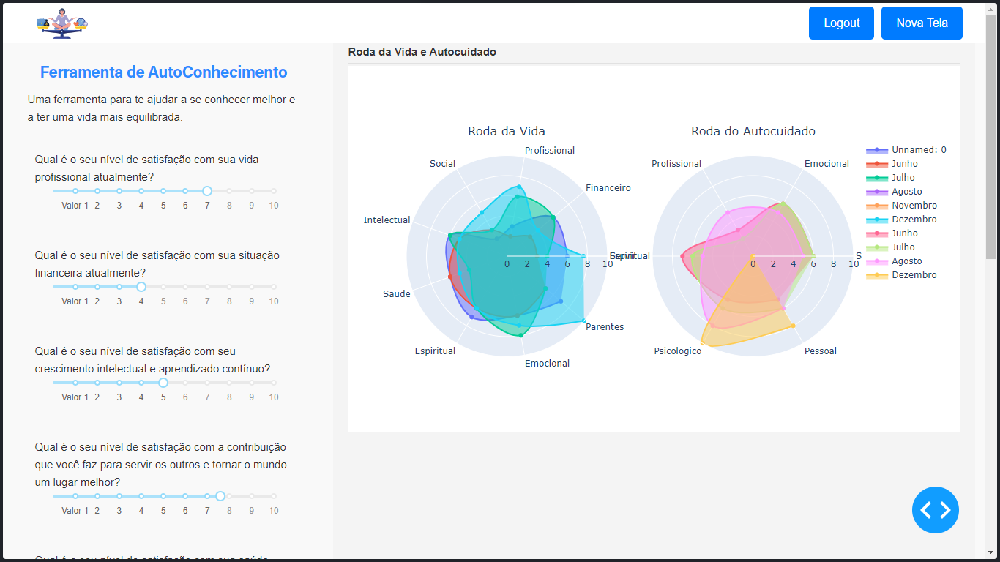

# Roda da Vida

## Introdução

A Roda da Vida é uma ferramenta de avaliação pessoal que nos ajuda a visualizar e equilibrar diferentes áreas de nossa vida. Ela é representada como um círculo dividido em 12 seções iguais, cada uma correspondendo a pilares ou setores essenciais em nossa vida. Essas áreas incluem Emocional, Espiritual, Família, Casamento/Parceria, Filhos, Social, Saúde, Contribuição, Intelectual, Financeiro, Carreira e Emocional (novamente).

## Como Usar

1. Clone o Repositório: `git clone https://github.com/your-username/wheel-of-life.git`
2. Abra o Script Python: `cd wheel-of-life && python main.py`
3. Ajuste as Escalas: Uma interface gráfica será exibida com 12 controles deslizantes. Ajuste cada controle deslizante para indicar seu nível de satisfação ou dedicação no aspecto correspondente da vida (escala: 1 a 10).
4. Clique no Botão "Atualizar": Após ajustar as escalas, clique no botão "Atualizar" para visualizar a Roda da Vida.
5. Analise e Reflita: Observe o gráfico da Roda da Vida para identificar áreas que precisam de melhoria ou que precisam de mais atenção.

## Capturas de Tela

Abaixo estão algumas capturas de tela da ferramenta Roda da Vida:

### Captura de Tela 1: Gráfico de Radar do Plotly

_Figura 1: Gráfico de Radar do Plotly_

### Captura de Tela 2: Roda da Vida do Dash

_Figura 2: Roda da Vida do Dash_

## 🤝 Contribuidores

<table>
  <tr>
    <td align="center">
      <a href="https://www.instagram.com/jaonativi/" title="Gerente de Projetos Desenvolvedor Backend">
         
        
          <b>João Natividade</b>
        
      </a>
    </td>
  </tr>
</table>