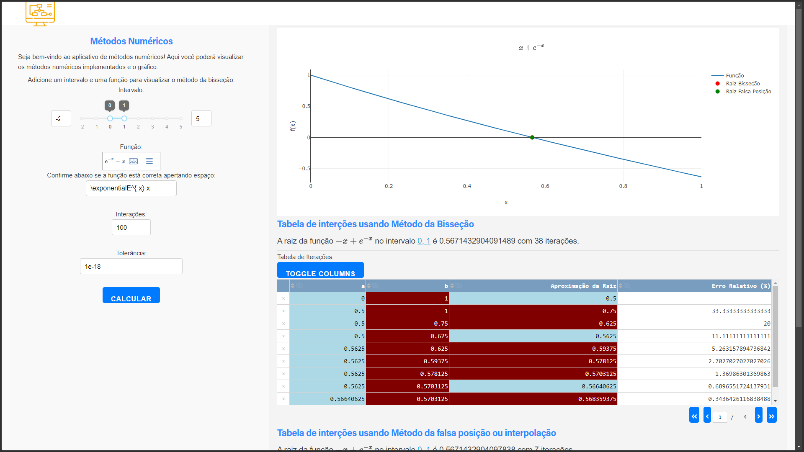

# Roda da Vida


[](https://github.com/joaosnet/wheel-of-Life/blob/master/README.md)




## Introdução

## Habilidades Desenvolvidas
  


## Como Usar

### No windows
1. Instale o [pyenv](https://github.com/pyenv-win/pyenv-win?tab=readme-ov-file#installation)

2. atualize o pyenv
```bash
pyenv update
```
3. instale o python 3.12
```bash
pyenv install 3.12
```
4. selecione o ambiente local e global
```bash
pyenv local 3.12
pyenv global 3.12
```
5. Instale o pipx
```bash
pip install pipx
```
6. Instale o poetry
```bash
pipx install poetry
```	
7. configure o poetry
```bash
poetry config virtualenvs.in-project true
```
8. Clone o Repositório: `git clone https://github.com/joaosnet/numerical-methods.git`

9. Instale as dependências
```bash
poetry install
```
10. Execute o aplicativo
```bash
python main.py
```

### No Linux
1. Instale o [pyenv](https://github.com/pyenv/pyenv?tab=readme-ov-file#installation)

2. atualize o pyenv
```bash
pyenv update
```
3. instale o python 3.12
```bash
pyenv install 3.12
```
4. selecione o ambiente local e global
```bash
pyenv local 3.12
pyenv global 3.12
```
5. Instale o pipx
```bash
pip install pipx
```
6. Instale o poetry
```bash
pipx install poetry
```	
7. configure o poetry
```bash
poetry config virtualenvs.in-project true
```
8. Clone o Repositório: `git clone https://github.com/joaosnet/numerical-methods.git`

9. Instale as dependências
```bash
poetry install
```
10. Execute o aplicativo
```bash
python main.py
```


## Capturas de Tela

<!-- ## 🤝 Contribuidores

<table>
  <tr>
    <td align="center">
      <a href="https://www.instagram.com/jaonativi/" title="Gerente de Projetos Desenvolvedor Backend">
        <br>
        <sub>
          <b>João Natividade</b>
        </sub>
      </a>
    </td>
  </tr>
</table> -->